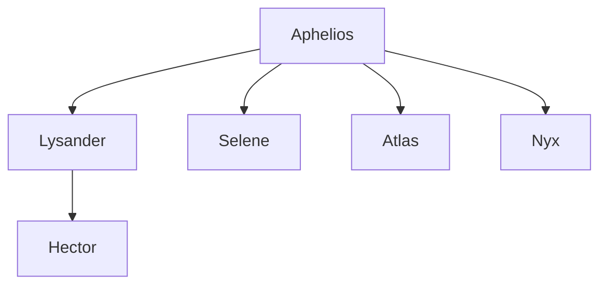

 The Cult of the Bull is a new cult created by Aphelios and Tauros to infiltrate Greece and influence the rising of the Minoan Empire.
 The cult worships the Bull God Tauros, and consider bulls a sacred animal.
 Their ritual involve acts of dismemberment and drunken, crazed parties that often end in intense violence.
 Aphelios has three lieutenants in the cult:
 
Selene, daughter of [[Artemis]]

![[Selene]]

![[Atlas]]

![[Nyx]]

The Cult of the bull, lead by the three lieutenants, was sent to the gates of Hades at Crete, the Oracle at Delphi, and the island of Delos.
There - 
- through her powers Nyx was able to avoid detection and open a small gate in Hades, through which souls could escape.
- Atlas was able to lead the cult in Crete to chain Persephone to the temple, 
- Selene ventured to the Oracle to poison her and influence the fates.

Aphelios, meanwhile, has been leading a small scale invasion with the help of the undead Island