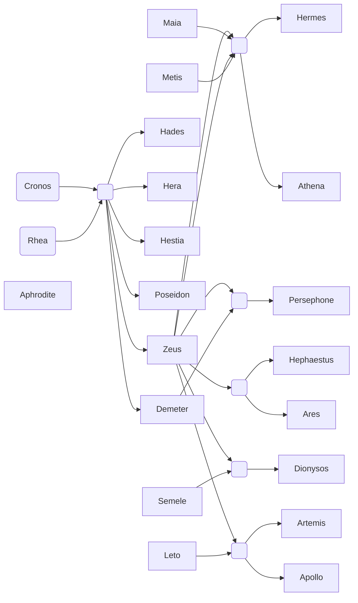

```mermaid
graph LR

Cr(Cronos) --> CR( )
R(Rhea) --> CR
CR --> Zeus
CR --> Demeter
CR --> Hades
CR --> Hera
CR --> Hestia
CR --> Poseidon
Zeus --> ZM( )
Maia --> ZM
ZM --> Hermes
Zeus --> ZD( )
Demeter --> ZD
ZD --> Persephone
Zeus --> ZH( )
ZH --> Hephaestus
ZH --> Ares
Zeus --> ZS( )
Semele --> ZS
ZS --> Dionysos
Zeus --> ZL( )
Leto --> ZL
ZL --> Artemis
ZL --> Apollo
Zeus --> ZM
Metis --> ZM
ZM --> Athena
Aphrodite
```

