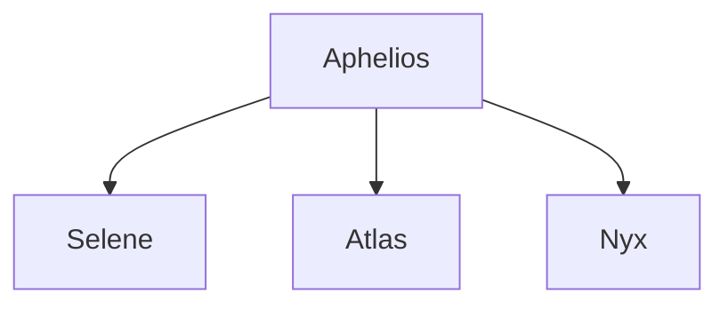

 The Cult of the Bull is a new cult created by Aphelios and Tauros to infiltrate Greece and influence the rising of the Minoan Empire.
 The cult worships the Bull God Tauros, and consider bulls a sacred animal.
 Their ritual involve acts of dismemberment and drunken, crazed parties that often end in intense violence.
 Aphelios has three lieutenants in the cult:
 
Selene, daughter of Artemis.
She was born defying the sacred oath of Artemis to eternal virginity, so Artemis forced her father, a noble hunter from Crete, to abandon her in the forest to hide her shame.
Her father later snuck back in secret to retrieve her, and passed her on to be raised in secret by some farmers.
He told them the story, and they in turn told her. In time, Selene grew bitter and angry at Artemis for forcing her father to abandon her, and when Aphelios met her on his journey to Crete and offered her to join him on his quest to raze Greece, she agreed.
 
Atlas, son of Ares.
Atlas was born in a quiet town to a martial artist named Cassandra.
When Ares showed interest in her prowess, Cassandra thought it was the best thing that could have happened to her, and sparred with him happily.
She would lose every time, and for a while they were happy.
After her son was born, Cassandra went back to sparring and through some turn of the fates, she beat Ares.
In his shame, Ares could not contain this defeat to a woman he once loved, and as punishment he drove her insane.
She tried to kill her son, but was stopped last second by her mother, Eleni.
Eleni, with no options left, had to kill her daughter.
She named her grandson Atlas, as a small retribution to the god of war. She raised Atlas to hate Olympus. When he was of age Atlas, now the strongest man in his village, ventured out to find a way to avenge his mother. When he met Aphelios, he knew he had found the best man for the job.

Nyx, daughter of Hades.
When Nyx was a young girl, she discovered she had an interest with animals, but only dead ones.
She could, without much effort, make a dead cat get up and walk around, if only for a short time.
Her mother, who refused to tell her who her father really was, sent her away in fear she would become like him.
Mad at her mother and the world, Nyx roamed Greece, only to find a small entrance to a cave, which she would follow.
Somehow, the monsters and obstacles in the cave gave her respect and she passed, untouched, into Hades.
There, she met a man who resembled her so much, that dark spark in his eyes, and she understood everything.
Nyx never felt so at home. But all was not well.
Nyx was hastily forced out of her new home by her father, who claimed she "was no daughter of his".
Heartbroken by the sudden loss, Nyx grew tired of this world, and set to take her life the next day. Lucky for her, she found Aphelios, almost as if by magic, to guide her to go back to Hades and take her rightful place on the throne.

The Cult of the bull, lead by the three lieutenants, was sent to the gates of Hades, the Oracle at Delphi, and the island of Crete.
There - through her powers Nyx was able to avoid detection and open a small gate in Hades, through which souls could escape.

Atlas was able to lead the cult in Crete to chain Persephone to the temple, 

and Selene ventured to the Oracle to poison her and influence the fates.

Aphelios, meanwhile, has been leading a small scale invasion with the help of the undead at the island of Delos.