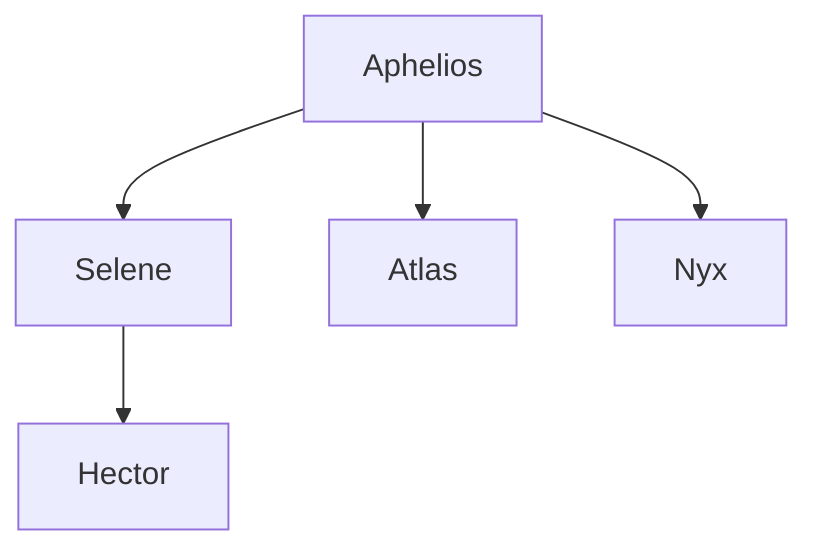

 The Cult of the Bull is a new cult created by Aphelios and Tauros to infiltrate Greece and influence the rising of the Minoan Empire.
 The cult worships the Bull God Tauros, and consider bulls a sacred animal.
 Their ritual involve acts of dismemberment and drunken, crazed parties that often end in intense violence.
 Aphelios has three lieutenants in the cult:
 
Selene, daughter of Artemis.
She was born defying the sacred oath of Artemis to eternal virginity, so Artemis forced her father, a noble hunter from Crete, to abandon her in the forest to hide her shame.
Her father later snuck back in secret to retrieve her, and passed her on to be raised in secret by some farmers.
He told them the story, and they in turn told her. In time, Selene grew bitter and angry at Artemis for forcing her father to abandon her, and when Aphelios met her on his journey to Crete and offered her to join him on his quest to raze Greece, she agreed.

Aphelios appointed Hector, son of Janus, as her second in command.
Not much is known about Hector, as he usually keeps to himself.
However, a large scar on his face, which makes hector look quite disfigured, is assumed to be from Janus himself. 
 
Atlas, son of Ares.
Atlas was born in a quiet town to a martial artist named Cassandra.
When Ares showed interest in her prowess, Cassandra thought it was the best thing that could have happened to her, and sparred with him happily.
She would lose every time, and for a while they were happy.
After her son was born, Cassandra went back to sparring and through some turn of the fates, she beat Ares.
In his shame, Ares could not contain this defeat to a woman he once loved, and as punishment he drove her insane.
She tried to kill her son, but was stopped last second by her mother, Eleni.
Eleni, with no options left, had to kill her daughter.
She named her grandson Atlas, as a small retribution to the god of war. She raised Atlas to hate Olympus. When he was of age Atlas, now the strongest man in his village, ventured out to find a way to avenge his mother. When he met Aphelios, he knew he had found the best man for the job.

Nyx, daughter of Hades.
When Nyx was a young girl, she discovered she had an interest with animals, but only dead ones.
She could, without much effort, make a dead cat get up and walk around, if only for a short time.
This, expectedly, caused Nyx to be bullied severely by the children in her village, and she learned the only solace she would receive would be from her "pets".
Her mother, who refused to tell her who her father really was, sent her away in fear she would become like him.
Mad at her mother and the world around her, Nyx develops an intense hatred for humans, and seeks out some kind of place she could call home.
Nyx roamed Greece, only to find a small entrance to a cave on the island of Crete, which she followed.
Somehow, the monsters and many dangerous obstacles were no challenge to Nyx, and she passed, untouched, into Hades.
There, she met a man who resembled her so much, a dark spark much like hers shone in his eyes. She knew she met her father
Nyx never felt so at home. 
Over the months she spent in the realm of the underworld, Nyx fell in love with it all. Cerberus, the lost souls roaming asphodel, and especially the strange Thanatos, manifestation of Death itself.
They developed an intense relationship, leading her to truly feel like someone understood her for the first time in her life.
But all was not well.
Hades, seeing his daughter gain respect and power in his realm, grew jealous, and cast Nyx out from his realm.
As a parting gift, Thanatos gave Nyx [[The Black Key]], which could open a back door to hades, should she ever want to come back to the underworld to see him.
Heartbroken by the sudden loss, Nyx grew tired of this world, and set to take her life the next day. 
In a surprising twist of fate, just as Nyx emerged from the underworld, she met Aphelios, who promised her this world, and hades with it, could end for all.

The Cult of the bull, lead by the three lieutenants, was sent to the gates of Hades at Crete, the Oracle at Delphi, and the island of Delos.
There - through her powers Nyx was able to avoid detection and open a small gate in Hades, through which souls could escape.

Atlas was able to lead the cult in Crete to chain Persephone to the temple, 

and Selene ventured to the Oracle to poison her and influence the fates.

Aphelios, meanwhile, has been leading a small scale invasion with the help of the undead at the island of Delos.